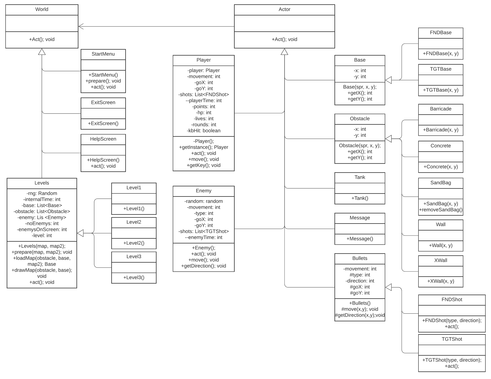

# Tankzors Fangame
Proyecto UASLP
Materia: Tecnología Orientada a Objetos.
Autores: Jesús Antulio Jiménez Delgado. Juan Josafat de la Cruz Sosa.
Profesor: Iván Israel Uresti Adame.

## ¿En qué consiste el juego?
En lograr que el personaje principal (tanque) logre termianr con los enemigos que se quieren apoderar del territorio.
## ¿Cuáles son las reglas?
Se debe de matar a todos los enemigos para poder superar el nivel.
El juego es de un jugador
## ¿Cómo se juega?
Para moverse, se utilizan las teclas de las flechas.
## Diagrama de Clases

## Enlaces
### Greenfoot
https://www.greenfoot.org/scenarios/25936
### Youtube
https://youtu.be/s1UkhAqw_tg
